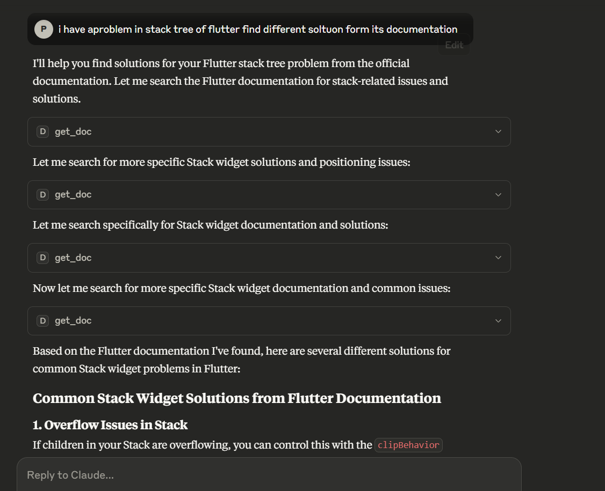

# Flutter Documentation MCP Server

{: style="width:50%;" }

A Model Context Protocol (MCP) server that fetches up-to-date Flutter documentation and Stack Overflow solutions directly through Claude Desktop.

## Features

- 🔍 **Instant Access** to official Flutter documentation
- 💡 **Stack Overflow Integration** for community solutions
- 🚀 **Context-Aware Answers** combining multiple sources
- ⚡ **JSON-RPC 2.0 Compliant** for seamless Claude integration

## How It Works

1. Ask Claude your Flutter development question
2. The MCP server:
   - Searches Flutter documentation (`docs.flutter.dev`)
   - Scans Stack Overflow for relevant solutions
   - Combines the best information
3. Returns a comprehensive, up-to-date answer

Example workflow:
```text
I have a problem in stack tree of flutter find different solution from its documentation

> Server searches Flutter docs and Stack Overflow
> Returns solutions including proper Stack widget usage and clipBehavior solutions